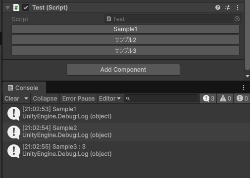
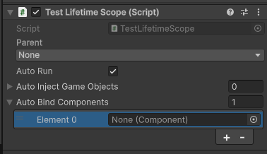
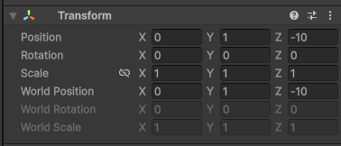

# `Utils.Unity` で提供するエディタ拡張機能群
## Utils.Unity
### 1. ButtonAttribute
以下のように実装すると、インスペクタービューでボタンが表示され、押下すると属性を付与したメソッドの処理が実行される．  
引数も設定可能．



```csharp
public class Test : MonoBehaviour
{
    [Button]
    private void Sample1()
    {
    Debug.Log(nameof(Sample1));
    }

    [Button("サンプル2")]
    private void Sample2()
    {
    Debug.Log(nameof(Sample2));
    }

    [Button("サンプル3", 3)]
    private void Sample3(int value)
    {
    Debug.Log($"{nameof(Sample3)} : {value}");
    }
}
```

### 2. IObjectReference
開発初期は `SerializeField` を使いたいが、後でAddressableに切り替えたい場合などに便利なインターフェイス．  
コード上は `IObjectReference` インターフェイスを経由して該当オブジェクトを参照できる．  
Unity エディタからは、`SerializeField` な参照を使うか、Addressable を利用した参照に切り替えるかを簡単な操作で切り替えることができる．


上記画像のうち、`Material1` は `SerializeField` で参照可能だが、`Material2` は Addressable の機能で参照可能．  
`Material3` にあるように、右上の歯車マークから、どちらの参照方法で参照するかを選択できる．

コード上のアクセスは、以下のように行う．

```csharp
public class Test : MonoBehaviour
{
    [SerializeReference]
    private IObjectReference<GameObject> _prefab;

    private async UniTaskVoid Start()
    {
        // prefabをロードしてインスタンス化.
        var instance = Instantiate(await _prefab.LoadAsync(destroyCancellationToken));
    }
}
```

### 3. SafeAreaAdjuster
セーフエリア対応コンポーネント．  
Canvasの直下の空オブジェクトにアタッチして、その子オブジェクトとしてUIを展開していければ、セーフエリアに対応したUIレイアウトが可能になる．  
なお、シミュレーターモードでのUI調整など、ゲーム再生外の状態でもセーフエリアの確認ができるように `Adjust SafeArea` ボタンを提供している．  


## Utils.Unity.UI
### 1. TextView
ここでは、`TextView` を継承した実装提供群をまとめて扱う．  
`TextView` はTextMeshProをラップするビュー．  
例えばint型の値をTextMeshProに表示したい場合、以下のように実装できる．  

```csharp
public class Test : MonoBehaviour
{
    [SerializeField]
    private TextView _textView;

    private void Start()
    {
        _intTextView.Bind(12345); // int型の値をバインドして表示.
    }
}
```

インスペクター上の表示は、以下のようになる．


| 設定項目   | 説明                   |
|--------|----------------------|
| Format | 表示上の数値書式指定文字列を指定できる． |
| Min    | 最小値を指定．              |
| Max    | 最大値を指定．              |

Formatで指定する数値書式指定文字列は `Project Settings > Format Settings` で設定できる．


#### 各型に対応したTextView

| 型               | 対応TextView       |
|-----------------|------------------|
| int             | IntTextView      |
| float           | FloatTextView    |
| System.DateTime | DateTimeTextView |
| System.TimeSpan | TimeSpanTextView |

### 2. SimpleGauge
`RectMask2D` を継承利用したシンプルで綺麗なゲージ表示.


| 設定項目  | 説明                |
|-------|-------------------|
| Mode  | ゲージの方向設定．上下左右の四択． |
| Value | ゲージの割合．(0 ~ 1)    |

### 3. SkewMeshEffect
UGUIのメッシュを斜めに変形するエフェクト.  
斜めHPゲージなどに利用可能.


| 設定項目 | 説明          |
|------|-------------|
| Skew | 斜めにする度合い設定． |

### 4. TapEffect
タップした位置にエフェクトを表示するコンポーネント.


| 設定項目      | 説明                      |
|-----------|-------------------------|
| （参照）      | `IObjectReference` で設定． |
| Max Count | タップエフェクトの表示最大数．         |
| Lifetime  | タップエフェクトの寿命（秒数）．        |

## Utils.Unity.VContainer
### 1. LifetimeScopeBase
継承して使う．  
なお、`Configure` メソッドで基底の実装を呼び出すことを忘れないように注意する．

```csharp
public class TestLifetimeScope : LifetimeScopeBase
{
    protected override void Configure(IContainerBuilder builder)
    {
        // 基底クラスのConfigureは必ず呼び出す.
        base.Configure(builder);
        
        // 以降にバインド実装を記述.
    }
}
```

標準提供の`LifetimeScope`が持つ機能に加えて、`Auto Bind Components` 機能が利用できる．



| 設定項目            | 説明                                                              |
|-------------------|-----------------------------------------------------------------|
| Auto Bind Components | `Auto Inject Game Objects` と異なり、登録されたコンポーネントをインジェクトだけでなくバインドもする． |

## Utils.Unity.Editor
### 1. TransformInspector
`Transform` コンポーネントのインスペクター表示を拡張する．  
標準の表示に加えて、ワールド座標での指定やワールド回転・ワールドスケールを確認できる．


